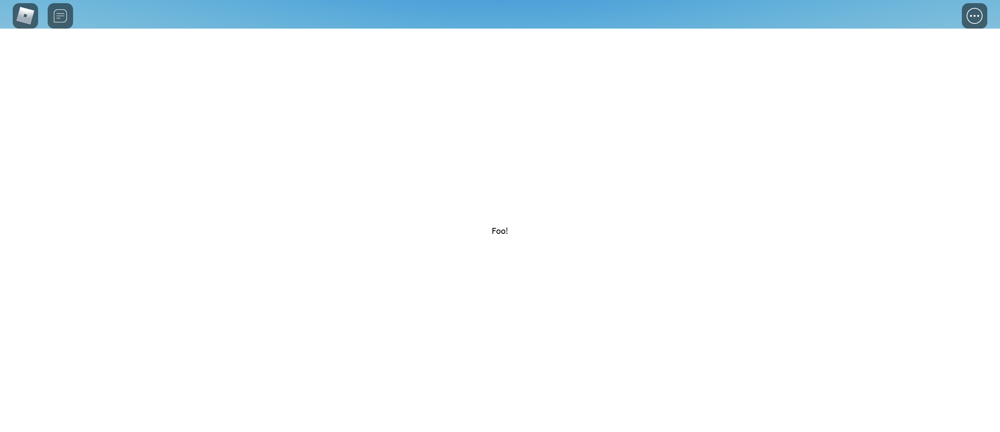
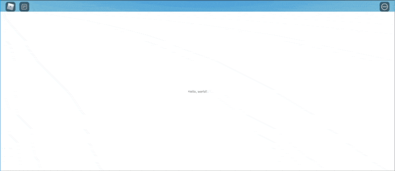

# Navigating Through Pages

We have learnt how to render the result, but a router isn't a router if it can't render another page. Let's learn how to do navigation in FusionRouter.

**Required code**
```lua
local Players = game:GetService("Players")
local ReplicatedStorage = game:GetService("ReplicatedStorage")
local Packages = ReplicatedStorage.Packages

local Fusion = require(Packages.Fusion)
local FusionRouter = require(Packages.FusionRouter)

local DemoRouter = FusionRouter {
	["/"] = {
        Data = {},
		Page = function()
			return Fusion.New "TextLabel" {
                Size = UDim2.fromScale(1, 1),
				Text = "Hello, world!"
			}
		end,
	},

	["/foo"] = {
        Data = {},
		Page = function()
			return Fusion.New "TextLabel" {
                Size = UDim2.fromScale(1, 1),
				Text = "Foo!"
			}
		end,
	},
}

DemoRouter:addRoute({
	Path = "/bar",
    Data = {},
	Page = function()
		return Fusion.New "TextLabel" {
            Size = UDim2.fromScale(1, 1),
			Text = "Foo, Bar!"
		}
	end,
})

local DemoUI = Fusion.New "ScreenGui" {
	ZIndexBehavior = Enum.ZIndexBehavior.Sibling,
	Parent = Players.LocalPlayer.PlayerGui,

	[Fusion.Children] = {
		Fusion.New "Frame" {
			Size = UDim2.fromScale(1, 1),

			[Fusion.Children] = { DemoRouter:getRouterView() }
		}
	}
}
```

## Pushing
FusionRouter exposes a method called `:push()` for navigating to a specific page. This is pretty much the only method to do navigation excluding `:back()`. Even though there is another method called `:setRoute()` which requires you to pick an actual route table from the router class itself, that method is counterproductive in many ways.

The `:push()` method requires a string parameter. That is to let FusionRouter know which page you are trying to go to. Let's try navigating to `/foo`:
```lua
local Players = game:GetService("Players")
local ReplicatedStorage = game:GetService("ReplicatedStorage")
local Packages = ReplicatedStorage.Packages

local Fusion = require(Packages.Fusion)
local FusionRouter = require(Packages.FusionRouter)

local DemoRouter = FusionRouter {
	["/"] = {
        Data = {},
		Page = function()
			return Fusion.New "TextLabel" {
                Size = UDim2.fromScale(1, 1),
				Text = "Hello, world!"
			}
		end,
	},

	["/foo"] = {
        Data = {},
		Page = function()
			return Fusion.New "TextLabel" {
                Size = UDim2.fromScale(1, 1),
				Text = "Foo!"
			}
		end,
	},
}

DemoRouter:addRoute({
	Path = "/bar",
    Data = {},
	Page = function()
		return Fusion.New "TextLabel" {
            Size = UDim2.fromScale(1, 1),
			Text = "Foo, Bar!"
		}
	end,
})

local DemoUI = Fusion.New "ScreenGui" {
	ZIndexBehavior = Enum.ZIndexBehavior.Sibling,
	Parent = Players.LocalPlayer.PlayerGui,

	[Fusion.Children] = {
		Fusion.New "Frame" {
			Size = UDim2.fromScale(1, 1),

			[Fusion.Children] = { DemoRouter:getRouterView() }
		}
	}
}

DemoRouter:push("/foo")
```


It's that simple! You just have to provide the path parameter to navigate to another page.

___

Now, let's make the `TextLabel` to `TextButton` and have it push to another page:
```lua
local Players = game:GetService("Players")
local ReplicatedStorage = game:GetService("ReplicatedStorage")
local Packages = ReplicatedStorage.Packages

local Fusion = require(Packages.Fusion)
local FusionRouter = require(Packages.FusionRouter)

local DemoRouter = FusionRouter {
	["/"] = {
        Data = {},
		Page = function()
			return Fusion.New "TextButton" {
                Size = UDim2.fromScale(1, 1),
				Text = "Hello, world!",

                [Fusion.OnEvent "Activated"] = function()
                    DemoRouter:push("/foo")
                end,
			}
		end,
	},

	["/foo"] = {
        Data = {},
		Page = function()
			return Fusion.New "TextButton" {
                Size = UDim2.fromScale(1, 1),
				Text = "Foo!",
                
                [Fusion.OnEvent "Activated"] = function()
                    DemoRouter:push("/bar")
                end,
			}
		end,
	},
}

DemoRouter:addRoute({
	Path = "/bar",
    Data = {},
	Page = function()
		return Fusion.New "TextButton" {
            Size = UDim2.fromScale(1, 1),
			Text = "Foo, Bar!",

            [Fusion.OnEvent "Activated"] = function()
                DemoRouter:push("/")
            end,
		}
	end,
})

local DemoUI = Fusion.New "ScreenGui" {
	ZIndexBehavior = Enum.ZIndexBehavior.Sibling,
	Parent = Players.LocalPlayer.PlayerGui,

	[Fusion.Children] = {
		Fusion.New "Frame" {
			Size = UDim2.fromScale(1, 1),

			[Fusion.Children] = { DemoRouter:getRouterView() }
		}
	}
}
```

Oh... hold on, notice how the `DemoRouter` in the `OnEvent` function is being underlined? That's because of how Luau works! Luckily, FusionRouter solved this problem for us. You see, if you ever looked into the source code, you will notice how when FusionRouter is rendering the page, it calls the function with an additional parameter. **That's a parameter table**, a detailed explaination of that can be found in later sections, but for now we will access the `Router` member in that parameter table.

Let's make those two functions to use the parameter table:
```lua
local DemoRouter = FusionRouter {
	["/"] = {
        Data = {},
		Page = function(params)
			return Fusion.New "TextButton" {
                Size = UDim2.fromScale(1, 1),
				Text = "Hello, world!",

                [Fusion.OnEvent "Activated"] = function()
                    params.Router:push("/foo")
                end,
			}
		end,
	},

	["/foo"] = {
        Data = {},
		Page = function(params)
			return Fusion.New "TextButton" {
                Size = UDim2.fromScale(1, 1),
				Text = "Foo!",
                
                [Fusion.OnEvent "Activated"] = function()
                    params.Router:push("/bar")
                end,
			}
		end,
	},
}
```
The `params.Router` member is a reference to `DemoRouter` in this situation, which allows you to do the same thing with `DemoRouter`. Now, let's hit 'Play' and see the results again:


Great! We have basically learnt the basics of FusionRouter at this point, but there are still a lot more to learn to actually use FusionRouter.

## Quick links:
- [All Tutorials](../README.md)
- [Home](../../README.md)