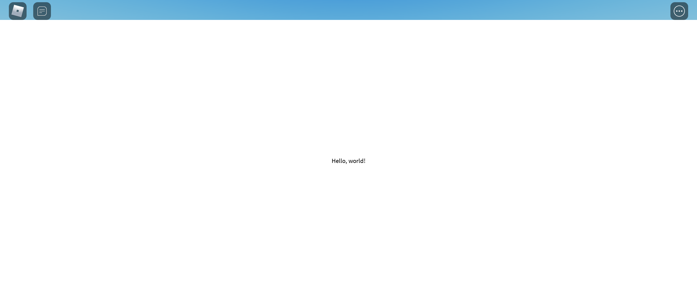

# Rendering Pages
As mentioned in the very first fundamental tutorial, without providing a way to render pages. There is no way for FusionRouter to actually display the results to human eyes. So, let's learn how to render the page out.

**Required code**
```lua
local Players = game:GetService("Players")
local ReplicatedStorage = game:GetService("ReplicatedStorage")
local Packages = ReplicatedStorage.Packages

local Fusion = require(Packages.Fusion)
local FusionRouter = require(Packages.FusionRouter)

local DemoRouter = FusionRouter {
    ["/"] = {
        Data = {},
        Page = function()
            return Fusion.New "TextLabel" {
                Size = UDim2.fromScale(1, 1),
                Text = "Hello, world!"
            }
        end,
    },

    ["/foo"] = {
        Data = {},
        Page = function()
            return Fusion.New "TextLabel" {
                Size = UDim2.fromScale(1, 1),
                Text = "Foo!"
            }
        end,
    },
}

DemoRouter:addRoute({
    Path = "/bar",
    Data = {},
    Page = function()
        return Fusion.New "TextLabel" {
            Size = UDim2.fromScale(1, 1),
            Text = "Foo, Bar!"
        }
    end,
})
```

## Creating A Canvas
We have defined three routes from the code above. What is missing at the moment is a location to actually render the page. Let's create a canvas for the page:

```lua
local DemoUI = Fusion.New "ScreenGui" {
    ZIndexBehavior = Enum.ZIndexBehavior.Sibling,
    Parent = Players.LocalPlayer.PlayerGui,

    [Fusion.Children] = {
        Fusion.New "Frame" {
            Size = UDim2.fromScale(1, 1),
        }
    }
}
```
Now, we have created a fullscreen canvas. We just need to tell FusionRouter to use this canvas. The router exposes a method for that, called `:getRouterView()`. When you call that method, it returns a `Frame` to display the rendered page. Let's attach the returned result inside the canvas:

```lua
local DemoUI = Fusion.New "ScreenGui" {
    ZIndexBehavior = Enum.ZIndexBehavior.Sibling,
    Parent = Players.LocalPlayer.PlayerGui,

    [Fusion.Children] = {
        Fusion.New "Frame" {
            Size = UDim2.fromScale(1, 1),

            [Fusion.Children] = { DemoRouter:getRouterView() }
        }
    }
}
```
Perfect! Let's hit 'play' and see the results:



With that, you can finally start to use FusionRouter in your project. However, [there's more](./Navigating_Pages.md)

**Finished code**
```lua
local Players = game:GetService("Players")
local ReplicatedStorage = game:GetService("ReplicatedStorage")
local Packages = ReplicatedStorage.Packages

local Fusion = require(Packages.Fusion)
local FusionRouter = require(Packages.FusionRouter)

local DemoRouter = FusionRouter {
	["/"] = {
        Data = {},
		Page = function()
			return Fusion.New "TextLabel" {
                Size = UDim2.fromScale(1, 1),
				Text = "Hello, world!"
			}
		end,
	},

	["/foo"] = {
        Data = {},
		Page = function()
			return Fusion.New "TextLabel" {
                Size = UDim2.fromScale(1, 1),
				Text = "Foo!"
			}
		end,
	},
}

DemoRouter:addRoute({
	Path = "/bar",
    Data = {},
	Page = function()
		return Fusion.New "TextLabel" {
            Size = UDim2.fromScale(1, 1),
			Text = "Foo, Bar!"
		}
	end,
})

local DemoUI = Fusion.New "ScreenGui" {
	ZIndexBehavior = Enum.ZIndexBehavior.Sibling,
	Parent = Players.LocalPlayer.PlayerGui,

	[Fusion.Children] = {
		Fusion.New "Frame" {
			Size = UDim2.fromScale(1, 1),

			[Fusion.Children] = { DemoRouter:getRouterView() }
		}
	}
}
```

## Quick links:
- [All Tutorials](../README.md)
- [Home](../../README.md)